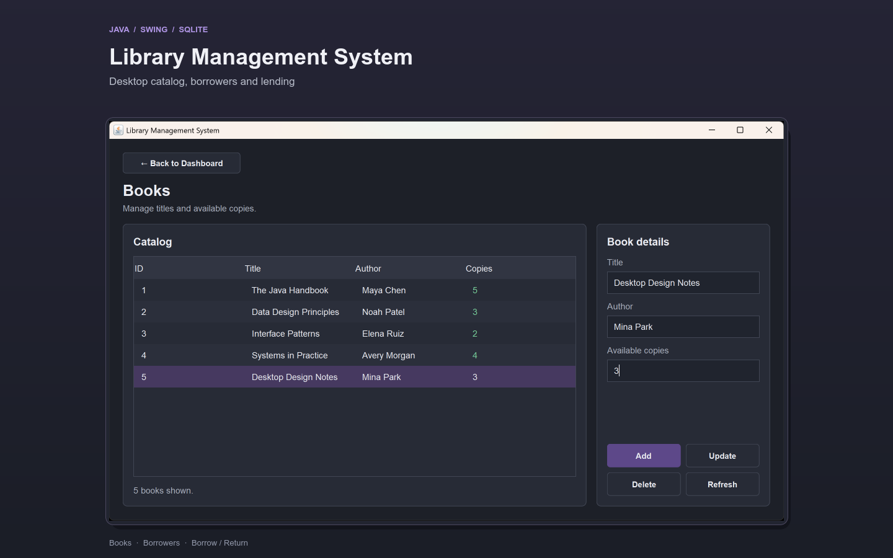
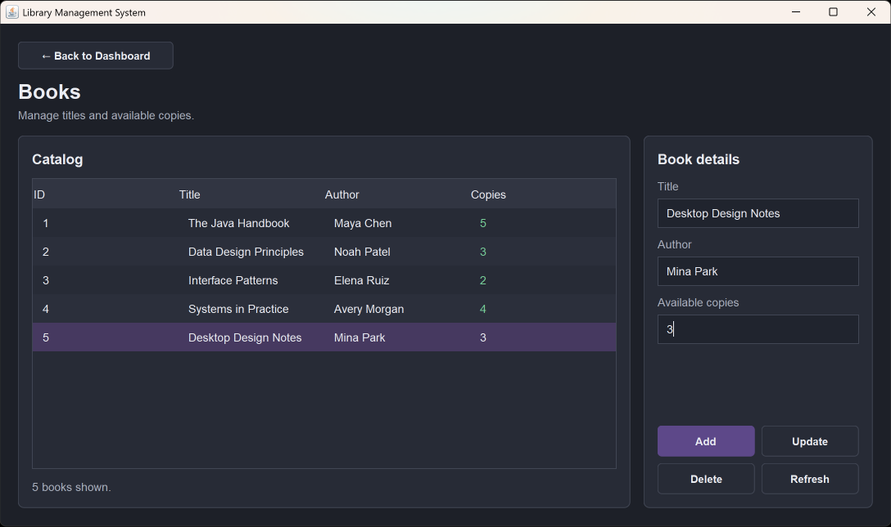

# Library Management System



Desktop application built with Java for managing books, borrowers, and lending transactions.

The project started as a college learning project and was later refactored to improve the database setup, validation, navigation, UI consistency, and overall project structure.

## Demo

🎥 **Application walkthrough**

[Watch the demo video](docs/media/library-demo.mp)

## Features

- Add, update, delete, and view books
- Manage registered borrowers
- Borrow and return books
- Track available book copies
- Input validation and user-friendly feedback
- SQLite database persistence
- Single-window navigation using `CardLayout`
- Dark desktop interface built with Java Swing
- DAO-based separation between UI and database access

## Tech Stack

- Java
- Java Swing
- JDBC
- SQLite
- Maven
- DAO Pattern
- Ready for JUnit 5 test expansion

## Screenshot



## Project Structure

```text
library-management-system/
├── src/
│   ├── DAO/
│   │   ├── BookDAO.java
│   │   ├── BorrowedBookDAO.java
│   │   ├── BorrowerDAO.java
│   │   └── DatabaseConnection.java
│   │
│   ├── Model/
│   │   ├── Book.java
│   │   └── Borrower.java
│   │
│   └── ui/
│       ├── BookUI.java
│       ├── BorrowerUI.java
│       ├── InputValidator.java
│       ├── LibraryAppFrame.java
│       ├── Main.java
│       ├── MainMenu.java
│       ├── TransactionUI.java
│       ├── UiFeedback.java
│       └── UiStyles.java
│
├── docs/
│   └── media/
│       ├── books-screen.png
│       └── library-demo.mp4
│
├── pom.xml
├── mvnw
└── mvnw.cmd
